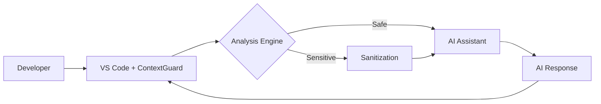

# CXG - Context eXtended Guard

---

## 🚨 The Hidden Crisis

- **67% of developers** use AI coding assistants daily
- **Companies unknowingly feed** proprietary algorithms, API keys, and trade secrets to AI models
- **No existing solution** protects code context before AI interaction
- **Legal and compliance risks** are mounting as companies realize the scope

## 🛡️ ContextGuard Solution

ContextGuard is an intelligent security layer that intercepts, analyzes, and sanitizes code before it reaches AI assistants. Think of it as a firewall for your intellectual property.

### ✨ Key Features

- 🚀 **Real-time Protection** - Sub-100ms analysis before code reaches AI
- 🧠 **Intelligent Detection** - Semantic understanding of proprietary logic vs. generic code
- 🔄 **Smart Sanitization** - Preserves functionality while removing sensitive data
- 📊 **Compliance Ready** - Complete audit trails for security teams
- 🌍 **Works Everywhere** - Supports all major AI assistants and IDEs

## 🏗️ Architecture



## 🚀 Quick Start

### For Developers

1. **Install the VS Code Extension**
   ```bash
   code --install-extension contextguard.contextguard-vscode
   ```

2. **Configure your security level**
   ```json
   {
     "contextguard.securityLevel": "balanced",
     "contextguard.enableOfflineMode": true
   }
   ```

3. **Start coding safely** - ContextGuard works silently in the background


## 📦 Repository Structure

This is a monorepo containing all ContextGuard components:

```
contextguard/
├── packages/
│   ├── vscode-extension/    # VS Code Extension (TypeScript)
│   ├── analysis-engine/     # Core Analysis Engine (Go)
│   ├── web-dashboard/       # Management Dashboard (React)
│   └── shared/             # Shared utilities and types
├── services/
│   ├── api-gateway/        # Edge API Gateway
│   ├── analysis-service/   # Deep Analysis Service
│   └── management-api/     # Admin API
├── infrastructure/         # IaC and deployment configs
├── docs/                  # Documentation
└── examples/             # Integration examples
```

## 🔧 Development

### Prerequisites

- Node.js 18+
- Go 1.21+
- Docker & Docker Compose
- VS Code (for extension development)

### Local Development

```bash
# Clone the repository
git clone https://github.com/mutuiris/cxg-vscode.git
cd cxg-vscode

# Install dependencies
npm install

# Start development environment
npm run dev

# Run tests
npm test
```


<div align="center">
  <b>Stop leaking secrets. Start protecting code.</b>
</div>
