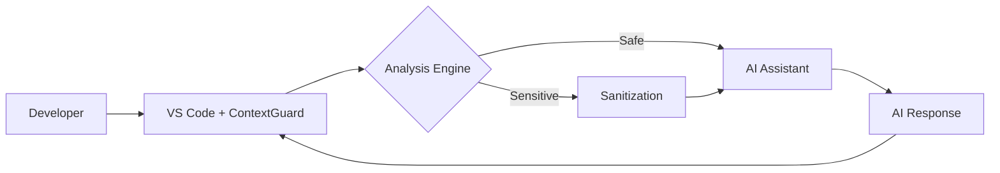

# CXG - Context eXtended Guard

**CXG** is a high-performance, AI-focused security layer for developers. Built for safeguarding intellectual property, CXG acts as a firewall for your codebase, ensuring safety and compliance when interacting with AI tools.

## Features

- **Real-time Protection**: Sub-100ms analysis before code reaches AI
- **Intelligent Detection**: Semantic understanding of proprietary logic vs. generic code
- **Smart Sanitization**: Preserves functionality while removing sensitive data
- **Compliance Ready**: Complete audit trails for security teams
- **Universal Compatibility**: Supports all major AI assistants and IDEs

## Architecture



## Getting Started

### Prerequisites

- Node.js 18+
- Go 1.21+
- Docker & Docker Compose
- VS Code (for extension development)

### Installation

1. Clone the repository:
```bash
git clone https://github.com/mutuiris/cxg-vscode.git
cd cxg-vscode
```

2. Install dependencies:
```bash
npm install
```

3. Start the development environment:
```bash
npm run dev
```

### Running the Extension

Install the VS Code extension:
```bash
code --install-extension contextguard.contextguard-vscode
```

Start coding safely—ContextGuard works silently in the background.

### Basic Commands

Configure your security level in `settings.json`:
```json
{
  "contextguard.securityLevel": "balanced",
  "contextguard.enableOfflineMode": true
}
```

## Repository Structure

```
contextguard/
├── packages/
│   ├── vscode-extension/    # VS Code Extension (TypeScript)
│   ├── analysis-engine/     # Core Analysis Engine (Go)
│   ├── web-dashboard/       # Management Dashboard (React)
│   └── shared/             # Shared utilities and types
├── services/
│   ├── api-gateway/        # Edge API Gateway
│   ├── analysis-service/   # Deep Analysis Service
│   └── management-api/     # Admin API
├── infrastructure/         # IaC and deployment configs
├── docs/                  # Documentation
└── examples/             # Integration examples
```

## Performance Highlights

CXG delivers exceptional performance for real-time analysis:

- **Real-time Analysis**: Sub-100ms processing
- **Concurrency**: Handles thousands of simultaneous requests
- **Memory Efficient**: Optimized for modern development environments

## Development

### Testing

Run the test suite:
```bash
npm test
```

### Contributing

1. Fork the repository
2. Create a feature branch
3. Make your changes
4. Add tests for new functionality
5. Submit a pull request

## License

This project is licensed under the MIT License - see the LICENSE file for details.

## Acknowledgments

- Inspired by modern security challenges in AI
- Built with Go and TypeScript for high performance and compatibility
